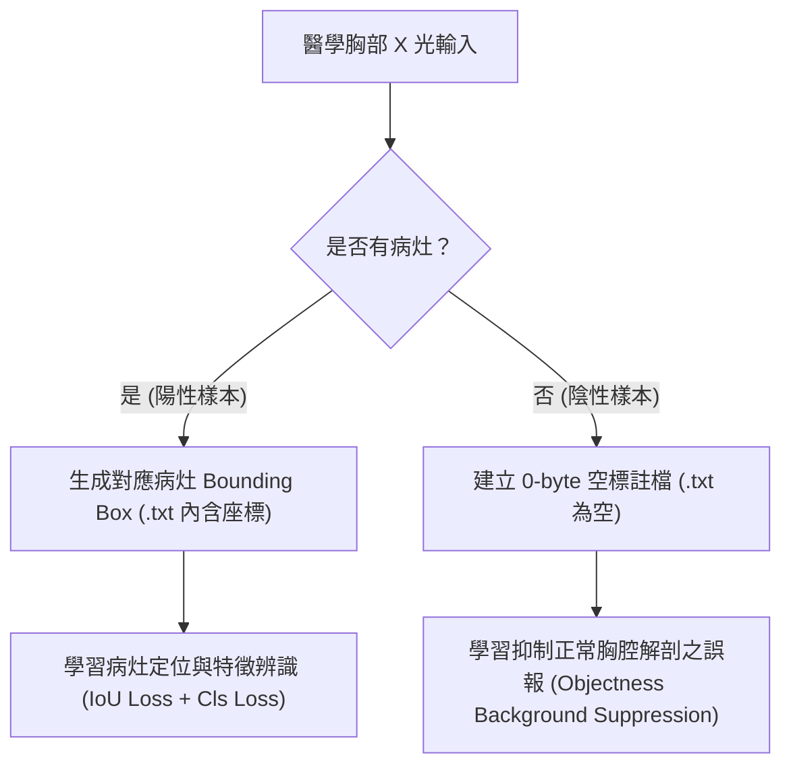

# 📊 YOLO_ChestXray 資料集架構與臨床病灶分析說明書 (Dataset Specification & Analysis)

本文件詳實記錄 **NIH ChestX-ray8 胸部 X 光病灶檢測資料集** 之結構劃分、14 類臨床病灶定義、背景負樣本設計機制以及標註標準規範，以表格化方式提供嚴謹的科學分析與說明。

---

## 📑 目錄
1. [資料集基本規格與資料集劃分](#1-資料集基本規格與資料集劃分)
2. [14 類胸部 X 光病灶分類與臨床病理特徵](#2-14-類胸部-x-光病灶分類與臨床病理特徵)
3. [背景負樣本（無-bbox-空標註）之臨床與-ai-訓練機制](#3-背景負樣本無-bbox-空標註之臨床與-ai-訓練機制)
4. [yolo-標註格式與座標正規化規範](#4-yolo-標註格式與座標正規化規範)
5. [資料集完整性檢驗與品質控制標準](#5-資料集完整性檢驗與品質控制標準)

---

## 1. 資料集基本規格與資料集劃分

| 項目指標 | 訓練集 (Train Set) | 驗證集 (Validation Set) | 全資料集總計 (Total) | 備註說明 |
| :--- | :---: | :---: | :---: | :--- |
| **影像總數 (Images)** | **631** 張 | **159** 張 | **790** 張 | 嚴格依循 80% / 20% 分割 |
| **陽性影像數 (含病灶 BBox)** | 553 張 ($87.64\%$) | 139 張 ($87.42\%$) | 692 張 ($87.59\%$) | 含有至少 1 個病灶標註 |
| **陰性影像數 (健康無病灶)** | **78** 張 ($12.36\%$) | **20** 張 ($12.58\%$) | **98** 張 ($12.41\%$) | 抑制假陽性之背景樣本 |
| **標註病灶總數 (Total BBoxes)** | 590+ 個 | **147** 個 | 737+ 個 | 部分影像具多重病灶併發 |
| **遺失檔案數 (Missing)** | **0** | **0** | **0** | 資料完整度 100% |
| **損壞影像數 (Corrupted)** | **0** | **0** | **0** | 經 PIL Header & MD5 驗證 |
| **原始影像解析度** | $1024 \times 1024$ | $1024 \times 1024$ | $1024 \times 1024$ | 單通道灰階 DICOM 轉 PNG/JPG |
| **實驗輸入解析度 (Exp1)** | $640 \times 640$ | $640 \times 640$ | $640 \times 640$ | 基礎對照組 (Baseline) |
| **實驗輸入解析度 (Exp2/3)** | $1024 \times 1024$ | $1024 \times 1024$ | $1024 \times 1024$ | 高解析度與醫學增強組 |

---

## 2. 14 類胸部 X 光病灶分類與臨床病理特徵

| 類別 ID | 英文標籤名稱 | 中文醫學名稱 | 臨床病理特徵與成因 | 典型 X 光成像特徵 (Radiological Features) | 邊界框分佈型態 (BBox Pattern) |
| :---: | :--- | :--- | :--- | :--- | :--- |
| **0** | **Atelectasis** | 肺膨脹不全 / 肺塌陷 | 支氣管阻塞或外力壓迫，導致肺泡氣體喪失萎陷 | 局部肺野密度增加、葉間裂移位、縱膈腔向患側偏移 | 局部片狀不規則框 |
| **1** | **Cardiomegaly** | 心臟肥大 | 高血壓、心臟衰竭或心瓣膜病變導致心臟擴大 | 心胸比率 (CTR) $> 50\%$，心影向左右兩側擴展 | 中央大面積包圍框 |
| **2** | **Effusion** | 肋膜積水 (胸水) | 肋膜腔內異常液體積聚（發炎、心衰或腫瘤引起） | 肋膈角變鈍（Blunting of Costophrenic Angle）、液面弧線 | 肺底兩側邊緣框 |
| **3** | **Infiltration** | 肺浸潤 | 肺實質受發炎細胞、液體或滲出物浸潤 | 邊緣模糊之斑片狀或毛玻璃狀陰影（Ground-glass） | 瀰漫性中大型框 |
| **4** | **Mass** | 腫塊 | 直徑 $> 3\text{ cm}$ 的肺部佔位性病變，惡性機率較高 | 邊界清晰或分葉狀的高密度緻密團塊，可能伴隨毛刺徵 | 局限性大型團塊框 |
| **5** | **Nodule** | 結節 | 直徑 $\le 3\text{ cm}$ 的局限性圓形或類圓形實質陰影 | 肺野孤立的小白點或圓形陰影，邊界多清晰 | 微小型精準框 (極難檢測) |
| **6** | **Pneumonia** | 肺炎 | 肺泡受細菌或病毒感染急性發炎，產生膿性分泌物 | 肺葉或肺段實變陰影、支氣管充氣徵（Air Bronchogram） | 片狀發散邊界框 |
| **7** | **Pneumothorax** | 氣胸 | 肺泡破裂氣體漏入肋膜腔，壓迫肺葉導致萎縮 | 肺外圍無肺紋理透亮帶、可見纖細的臟層肋膜線 | 肺側邊狹長條狀框 |
| **8** | **Consolidation** | 肺實變 | 肺泡內氣體被炎性滲出物、血液或水腫液完全取代 | 高密度均勻緻密影，遮蔽周邊血管紋理 | 中大型緻密區塊框 |
| **9** | **Edema** | 肺水腫 | 肺微血管壓力升高致液體滲入間質與肺泡 | 肺門周圍對稱性「蝴蝶翼狀（Bat-wing）」陰影、Kerley B 線 | 雙側肺門中心框 |
| **10** | **Emphysema** | 肺氣腫 | 肺泡壁破壞與過度充氣膨脹，氣道彈性下降 | 雙肺過度透亮（過黑）、膈肌低平、肋間隙增寬 | 雙肺大範圍透亮框 |
| **11** | **Fibrosis** | 肺纖維化 | 慢性發炎導致肺組織纖維化疤痕組織增生 | 網狀、索條狀陰影，後期形成「蜂窩肺（Honeycomb）」 | 條索狀瀰漫網格框 |
| **12** | **Pleural_Thickening**| 肋膜增厚 | 肋膜炎、石綿暴露或感染後纖維化增厚 | 沿胸壁邊緣出現平滑或結節狀的條帶狀高密度影 | 胸壁邊緣細長條框 |
| **13** | **Hernia** | 橫膈疝氣 | 腹腔器官（如胃、腸）經橫膈缺損上移至胸腔 | 膈肌上方可見含氣囊腔或腸道積氣波紋，縱膈偏移 | 膈上異常解剖框 |

---

## 3. 背景負樣本（無 BBox 空標註）之臨床與 AI 訓練機制

在資料集掃描日誌中顯示的 `78 empty (Train)` 與 `20 empty (Val)` 代表「**健康正常無病灶的胸部 X 光片**」，其設定原理如下：



| 比較維度 | 僅使用陽性樣本 (100% 帶標註框) | 包含 12.4% 陰性負樣本 (本專案配置) | 臨床優勢與意義 |
| :--- | :--- | :--- | :--- |
| **模型預測傾向** | 產生「凡圖必框」的先驗偏見 | 具備判斷「正常健康」與「異常病灶」之能力 | 貼近真實臨床篩檢環境 |
| **假陽性率 (False Positives)** | **極高**（易將鎖骨、心影或肋骨交叉誤判為病灶） | **顯著降低**（背景損失會懲罰無端框選） | 避免造成病患恐慌與非必要複診 |
| **特異度 (Specificity)** | 低 | **極高** | 醫學 AI 臨床落地之關鍵指標 |
| **背景損失 (Objectness Loss)** | 僅由無目標網格提供微弱反饋 | 由整張無病灶影像提供強大負向約束反饋 | 強化 YOLO 檢測頭對正常組織的鑑別力 |

---

## 4. YOLO 標註格式與座標正規化規範

本資料集採用標準 YOLO 目標檢測格式，所有座標均正規化（Normalized）至 $[0, 1]$ 區間：

$$\text{正規化公式：} \quad x_{\text{center}} = \frac{X_{\text{center}}}{W_{\text{img}}}, \quad y_{\text{center}} = \frac{Y_{\text{center}}}{H_{\text{img}}}, \quad w = \frac{W_{\text{box}}}{W_{\text{img}}}, \quad h = \frac{H_{\text{box}}}{H_{\text{img}}}$$

### 標註文字檔結構範例：
```text
<class_id> <x_center> <y_center> <width> <height>
```

| 欄位名稱 | 資料型態 | 數值範圍 | 說明與限制 |
| :--- | :---: | :---: | :--- |
| **class_id** | 整數 (Integer) | $0 \sim 13$ | 對應 14 類胸部病灶 ID（參見第 2 節） |
| **x_center** | 浮點數 (Float) | $(0.0, 1.0)$ | 邊界框幾何中心相對於影像寬度之比率 |
| **y_center** | 浮點數 (Float) | $(0.0, 1.0)$ | 邊界框幾何中心相對於影像高度之比率 |
| **width** | 浮點數 (Float) | $(0.0, 1.0]$ | 邊界框寬度相對於影像寬度之比率 |
| **height** | 浮點數 (Float) | $(0.0, 1.0]$ | 邊界框高度相對於影像高度之比率 |

---

## 5. 資料集完整性檢驗與品質控制標準

在執行任何實驗訓練前，系統透過 [`scripts/dataset_utils.py`](scripts/dataset_utils.py) 進行嚴格的四道品質防線校驗：

| 品質檢驗關卡 | 檢驗標的與算法 | 通過門檻與容錯標準 | 本專案執行結果 |
| :--- | :--- | :--- | :---: |
| **1. 檔案損壞檢驗** | PIL `Image.verify()` 與色彩空間解析 | 影像能正確解碼且寬高皆 $> 0$ | ✅ **100% 通過 (0 損壞)** |
| **2. 重複影像檢驗** | MD5 全檔案二進位雜湊比對 | 無完全相同之雜湊碰撞 | ✅ **100% 通過 (0 重複)** |
| **3. 座標邊界檢驗** | 邊界框是否溢出邊界 ($0 \le x,y,w,h \le 1$) | 無負數或大於 1.0 之越界座標 | ✅ **100% 通過 (0 越界)** |
| **4. 成對關聯檢驗** | 影像檔案與標註檔案 Stem 匹配 | 訓練與驗證集所有影像皆有對應 `.txt` | ✅ **100% 通過 (0 遺失)** |

---

> 📌 **相關檔案連結**：
> - 資料集設定檔：[`configs/chestxray.yaml`](configs/chestxray.yaml)
> - 資料檢驗工具：[`scripts/dataset_utils.py`](scripts/dataset_utils.py)
> - 完整性報告輸出：`reports/dataset_integrity_report.csv`
